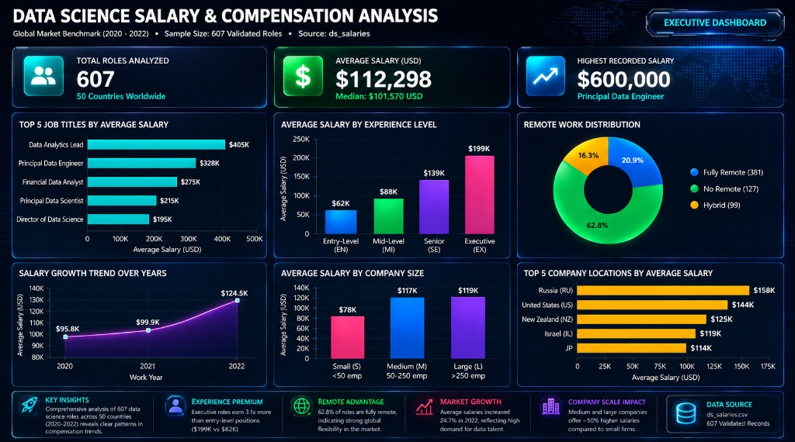

# 📊 Global Data Science Salaries & Compensation Analysis (2020 - 2022)

[](https://www.python.org/)
[](https://pandas.pydata.org/)
[](https://jupyter.org/)
[](https://opensource.org/licenses/MIT)

> An end-to-end data analytics project exploring **600+ real-world tech compensation records** across 50 countries. Features an exploratory data analysis (EDA) Jupyter Notebook, an interactive web application dashboard, and executive market benchmarking.

---

## 📸 Executive Dashboard Preview



---

## 🎯 Project Objectives & Business Context

In the fast-evolving tech landscape, data professionals and hiring managers require transparent, data-driven benchmarks for compensation. This project answers critical industry questions:
- **Which roles command the highest market premiums?**
- **How steep is the career progression multiplier from Junior to Executive level?**
- **Does 100% remote work correlate with higher or lower compensation?**
- **How much more do large enterprises pay compared to small startups?**
- **How did salaries evolve post-2020?**

---

## 🔍 Key Findings & Market Insights

| Metric / Dimension | Benchmark / Finding | Key Takeaway |
| :--- | :--- | :--- |
| 💰 **Global Average Salary** | **$112,298 USD** (Median: $101,570) | Peak compensation reached **$600,000 USD** |
| 🚀 **Experience Multiplier** | **3.1x Jump** ($62K → $199K) | Executive & Director roles earn over 3x entry-level salaries |
| 🌐 **Remote Work Adoption** | **62.8% Fully Remote** (381 roles) | Remote positions pay on par or higher than on-site equivalents |
| 📈 **YoY Salary Growth** | **+24.7% Surge in 2022** | Accelerated demand for Data Engineers & ML Specialists |
| 🏢 **Enterprise Scale Premium** | **~50% Higher Compensation** | Medium (50-250) and Large (>250) companies significantly outpay startups |

---

## 📁 Repository Structure

```text
├── ds_salaries.csv                            # Raw dataset (607 records)
├── Data_Science_Salaries_Analysis.ipynb       # Clean, executed EDA Jupyter Notebook
├── Data_Science_Salaries_Dashboard.png        # High-res Executive Dashboard
├── index.html                                 # Standalone interactive web dashboard (Tailwind + Chart.js)
├── requirements.txt                           # Python dependencies
├── .gitignore                                 # Git ignore rules
└── README.md                                  # Project documentation
```

---

## 🛠️ Tech Stack & Tools

- **Programming & Analysis:** Python (Pandas, NumPy)
- **Data Visualization:** Matplotlib, Seaborn
- **Interactive Web App:** Standalone HTML5/JS (Tailwind CSS, Chart.js, Lucide Icons)
- **Environment:** Jupyter Notebook

---

## 🚀 Getting Started

### 1. Clone the repository
```bash
git clone https://github.com/Ibrahim2005507/Data-Science-Salaries-Dashboard.git
cd Data-Science-Salaries-Dashboard
```

### 2. Install dependencies
```bash
pip install -r requirements.txt
```

### 3. Run the Jupyter Notebook
```bash
jupyter notebook Data_Science_Salaries_Analysis.ipynb
```

### 4. Open the Standalone Web Dashboard
Simply double-click `index.html` to launch the interactive dashboard in any modern web browser — no server required!

---

## 👤 Author & Connect

- **GitHub:** [@Ibrahim2005507](https://github.com/Ibrahim2005507)

---

## 📄 License
This project is open-source and available under the [MIT License](LICENSE).
